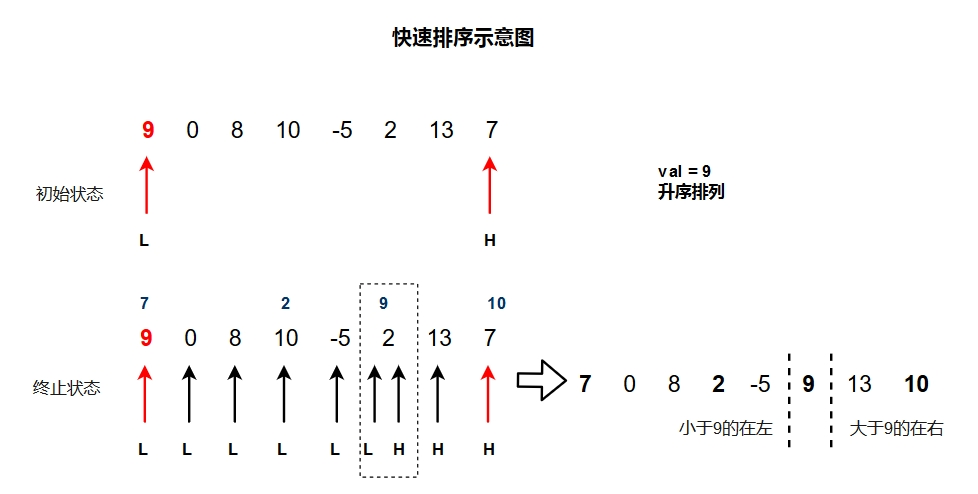

# 数据结构学习（C/C++）

笔记和代码根据**郝斌**老师的网络课程整理，代码部分不完全跟老师课堂上一致，但思路基本一致。

另外在cpp文件中，添加了大量的注释，可以直接当做笔记阅读。


> 课堂笔记摘录：

## 一、基本概念

**数据结构定义**：
我们如何把现实中大量而复杂的问题以特定的数据类型和**特定的存储结构**保存到主存储器（内存）中，以及在此基础上为实现某个功能（比如查找、删除、排序）而执行的**相应操作**，这个操作就是算法。
说白了，就是如何把一个个数据，以及**数据之间的关系**存储到内存中。

**衡量算法的标准**:

1. 时间复杂度（程序要执行的次数，而非确定时间）
2. 空间复杂度（算法执行过程中所占用的最大内存）
3. 难易程度
4. 健壮性

狭义的算法跟数据存储有关；
广义的算法跟数据存储无关；

何谓**泛型**：
即某种技术，可以使得不同的存储方式，执行的操作是一样的。

同一种逻辑结构，无论其内部的存储结构是什么样子，都可以对它执行相同的操作。

**预备知识**：

- 指针：
指针是C语言的灵魂。
定义：就是地址，内存单元的编号，从0开始的非负整数，0 -- FFFFFFFF（4G-1）【？？】
指针就是地址，地址就是指针。
指针的本质是一个操作受限的非负整数。
**指针变量**是存放内存单元地址的变量！


## 二、线性结构

 把所有的节点用一根线连起来的结构。
**连续存储**-->数组
  优点：存取速度快
  缺点：插入删除慢，事先必须知道数组长度，需要大块连续内存
**离散存储**-->链表
  优点：插入删除快，不用事先定义长度
  缺点：存取速度慢

线性结构的两种常见应用：栈，队列。

### （一）线性结构的两种数据结构：

#### 1.数组

笔记见程序。

#### 2.链表：

首节点：第一个有效节点
尾结点：最后一个有效节点
**头结点** ：数据类型和首节点一样。首节点之前的一个节点，**不存放有效数据**，其作用是为了方便链表的操作。
头指针：指向头结点的指针变量，是头结点的地址
尾指针：指向尾结点的指针变量


>要对一个链表进行处理，需要知道的参数：头指针。
>只需要这么一个玩意儿就够了，就可以知道所有的数据，以及链表的长度等信息。

**链表的分类：**
单链表
双链表：每一个节点有两个指针域
循环链表：能通过任何一个节点，找到所有其他节点
非循环链表


### （二）线性结构的两种应用

#### 1. 栈

**定义**：一种可以实现先进后出的存储结构，类似于箱子。

**分类：**
    静态栈：以数组为基本内核
    动态栈：以链表为基本内核

**动态栈的算法：**
就是把链表的一些功能给砍掉，例如不允许在头部插入，不允许删除中间的元素等等。
    出栈
    压栈（入栈）


**栈的应用：**

- 函数调用就是考栈的思路实现的。
  f调用g，g调用k；
  执行的时候，先执行k，再g再f
- 中断
- 表达式求值 （两个栈可以编写计算器）
- 内存分配
- 缓冲处理
- 迷宫

#### 2.队列

**定义**：一种够可以实现“先进先出”的数据结构
**分类**：
    链式队列
    静态队列
        静态队列通常都必须是循环队列

**静态队列需要搞清楚的几个点：**

1. **为啥必须是循环队列**
    如果按照普通的数组去形成队列的话，那删除元素后，front的位置就会往上移动，队列的前面就会空出来位置，这些位置就浪费了。如果添加元素，那rear也会往上移动。这样的结果就是，无论是入队还是出队，两个都往上移，空间就越来越少，操作不方便。
所以，关键是需要，在添加元素的时候，如果rear已经到顶部，rear可以从上面跳到下面接上去。

2. **循环队列需要几个参数来确定**
       两个，front和rear，front（前台）掌管出对，rear掌管入对，在不同场合中：
       1).  队列初始化：两者都为零
       2).  队列非空：
             front代表的是队列的第一个元素
             rear代表的是队列的最后一个有效元素的下一个位置
       3).  队列空：front和rear的值相等，但不一定为零
   
3. **循环队列各个参数的含义**

4. **入对，出对算法**
   
   入队：

```
1.把新增元素添加到当前r的位置
2.r = (r+1)%maxlen
```

​       出队：

```
f = (f+1)%maxlen
```

5. **如何判断空、满**
       空：front与rear的值相等，就一定为空
       满：这个有点难判断，因为满的时候，似乎f也跟r相同了。
   这个时候有两种办法处理：一种是添加一个参数，记录元素个数。第二种就是，不让队列的所有位置都可以放值，而是始终空出一个位置，让r的永远是一个空位置。这样，满的状态就是`r==(f-1)%maxlen`或者`f==(r+1)%maxlen`。

**队列的应用**：
所有和时间有关的操作都有队列的影子。


##  三、递归
**递归的定义：**
一个函数自己调用自己


**递归要满足的三个条件：**

1. 递归必须有一个明确的终止条件
2. 该函数处理的问题规模必须在递减
3. 这个转化必须是可解的


**循环和递归的对比：**

递归：

- 好理解
- 运行速度慢
- 存储空间大

循环：

- 不好理解
- 运行速度快
- 存储空间小


**递归的例子：**

- 求阶乘；求和；

- **汉诺塔问题**（见程序）
- 斐波那契数列


递归的应用：

1. 树、森林就是用递归的方式定义的
2. 树、森林、图的很多算法使用递归实现的


## 四、非线性结构


### （一） 树

#### 1.树的定义：

- 专业定义：有且只有一个根节点，有若干个互不相交的子树，这些子树本身也是树。

- 通俗定义：树是由节点和边组成，每个节点只有一个父节点，但可以有多个子节点，但有一个例外节点没有父节点，那就是根节点。

- 郝斌名言：我不知道谁管这玩意儿叫树，这明明就是串葡萄。


#### 2.关键术语：

深度：根节点到最底层节点的层数

度：子结点的个数，就是某节点的度


#### 3.树的分类：

- 一般树：子结点数目没有限制
- 二叉树：子结点最多两个，而且子节点有顺序的，位置不能更改
  1. 一般二叉树
  2. 满二叉树：在不增加层数的前提下，无法增加节点的二叉树。（增加节点，只能增加层）
  3. **完全二叉树**：只是删除了满二叉树的最底层的从后往前（从右到左）的若干个节点形成的树。（注意不一定每个节点子结点个数都是2，也可能是0和1）。完全二叉树的一个特例就是满二叉树。
- 森林：n个互不相交的树的集合


#### 4.树的存储：

- **二叉树的存储**：

  - 连续存储：用数组存储，必须先转化成完全二叉树
       原因：如果只存储有效节点，那么我们无法知道树是如何构造的。
    
    如图，红色点为转化成完全二叉树需要增加的点，黄色框框里的点可以删除。
    但是这样还是会额外添加很多很多垃圾节点。

    优点：查找某节点的父节点、子节点很快。
    缺点：十分耗内存

  - 链式存储
    链式存储，类似于链表的方式。每个节点有三部分：自己的值、左子节点的地址、右子节点的地址。当然也可以再保存一个父节点的地址。

    优点：内存浪费比较少，只是线性的浪费。N个节点只浪费N+1个空间。
    缺点：如果没有保存父节点地址的话，那一般想查找父节点是十分困难。

- **一般树的存储**：
  - 双亲表示法
    每个节点，保存其父节点的下标
  - 孩子表示法
    每个节点，保存其子节点的一个链表（因为子节点可能不止一个）
  - 双亲孩子表示法
    就是结合上面两种方法
  - 二叉树表示法
    把一个普通树转化成二叉树：
    **每个节点有两个指针，左指针指向其第一个子节点，右指针只向其第一个兄弟节点**。这样就可以形成一个二叉树。
    
    可以发现，转过来的二叉树一定没有第一个右分支。

- 森林的存储：
  转化成二叉树存储。
  转化方法跟普通树转二叉树的方式类似，区别就是，森林中，多棵树的根节点我们认为是兄弟关系。


#### 5.树的操作：
**遍历**：（可以发现，这些都是递归）

- 先序遍历[先访问根节点]：
先访问根节点；
先访问左子树，再访问右子树。


- 中序遍历[中间访问根节点]：
先中序遍历左子树；
再访问根节点；
再中序遍历右子树；

- 后序遍历[最后访问根节点]：
先后续遍历左子树；
再后续遍历右子树；
再访问根节点。


**！！已知两种遍历序列推出原始二叉树：**
已知一个遍历序列，是无法推出原始二叉树是样子的。
但是，已知先序和中序，或者已知中序和后序，是可以推出来的。
（但是，已知先序和后序，也是无法推出来的）

实例自查：
先序：ABCDEFGH
中序：BDCEAFHG
\>\>
后序：DECBHGFA


先序：ABDGHCEFI
中序：GDHBAECIF
\>\>
后序：GHDBEIFCA


根据后序、中序求二叉树和先序，也是类似的。

主要的思想就是：
**通过先序或者后序确定每个树的根节点，然后就可以利用中序把左右树分开，得到新树之后，就又可以通过先序或者后序确定根节点。以此类推。**


#### 6. 树的应用

- 树是数据库中数据组织的一种重要形式。例如文件系统。

- 操作系统子父进程就是树。

- 面向对象编程中的类的继承关系就是树。

- 霍夫曼树
- ... ...


## 五、查找和排序

查找：

折半查找


**排序：**

- 冒泡排序：

  先让N个元素从左到右两两比大小，大的放后面，从而让最大的排到队尾；
  再让前N-1个这样做，让第二大的排到队尾前一个；
  以此类推。

- 插入排序：

  把第二个插入到前一个，使前两个有序；
  把第三个插入到前两个，使前三个有序；
  以此类推。

- 选择排序：

  先从所有N个数中，选最小的，跟第一个位置互换；
  再从剩下的N-1个中，选最小的，跟第二个位置互换；
  以此类推；

- 归并排序：

  两两比较，并排序；
  再在上一层的基础上，再两两比较，并排序；
  以此类推。
  （用郝老师的话：先两两有序，再四个四个有序，再八个八个有序......）

- 快速排序


快速排序：
总体思想：
每次确定第一个数的排序后的位置，把列表一分为二，大的在右边，小的在左边；
然后将两边的数列进行上面同样的操作。

例如，初试状态：

我们给头尾各设立一个指针，L和H；和一个临时变量val保存第一个元素的值。
然后我们设定一个规则来移动H和L，以达到我们期望的效果。


怎么移动呢？
我们要保证，L指向的位置的左边，一定都小于9；
H指向的位置的右边，一定都大于9；
如果可以这样，那么当H和L移动到同一位置时，那个位置就是9应该的位置。

具体如下：
先看H从右到左扫描，如果指向的值小于9，那么就让这个元素赋值到L所指元素；
然后再移动L，现在L所指元素为7,7小于9，fine，接着移动，发现0,8都小于9，所以还要移动，移动到10发现终于有一个比9大了，那么这个10就应该被转移到H所指位置；
然后H再次出动，从右到左寻找比9小的值，于是就移动到了2，把2赋值给L位置；
然后L再移动，经过-5，碰到了H。
终于，本轮游戏结束，9到了目标位置，同时左右边分得清清楚楚（虽然还是无序的，但是整体是有序的）。